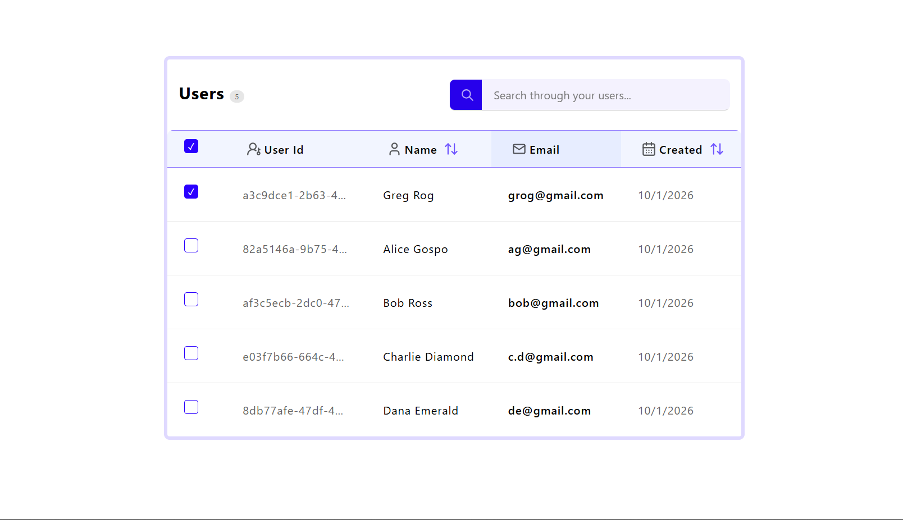

# Table Component

# Purpose 
A table is a component structured to represent data of several types which can be static, dynamic, modified, and even deleted, in rows and columns. It may support images, multiple actions, icons, sorting, filtering, and all sorts of operations to convey the structure of the data it renders.

Example: 

# Upcoming
- [] Sorting
- [] Searching
- [] Images in data
- [] Actions e.g. edit and delete
- [] Copy ID button on ID hover

# Dependencies
- initializeIcons:
Makes use of a function that searches for the ```[data-icon]``` attribute in elements(commonly spans), and inserts icons into them by checking if their dataset matches the icons library object [Icon Library](../../../Assets/Icons/icons.js).

- Checkbox Component:
A component that allows checking of elements. Useful for selecting multiple elements, and enabling mass actions like deletion [Custom Checkbox](../../form/checkbox/checkbox.js).

- Search Input Component:
A component that makes use of filtering to search through data, allowing a "zoom in" of what the user finds important to view [Search Input](../../form/search/searchInput.js).

# Anatomy
The structure of the table includes making use of internal data that is exposed, so that it can be decided by user-configuration. This allows dynamic header, and row data content to be absorbed by the table by just a change of statement. These internal state exposed by the table's API is used to render itself and the data that builds it.

```js
    render() { // Render function called by the table on connectedCallback to compose the rendering of itself
        this.renderCount(); // Rendering the count of the table data
        this.renderHeader(); // Rendering the headers of the table
        this.renderRow(); // Rendering the rows of the table
    };

    renderCount(){
        this.table.querySelector(".data-count").textContent = data.length; // Assigning the length of the data to a table element
    };
    
    renderHeader() {
        this.headers.forEach(header => { // Looping through internal header data
            const th = headerTemplate.content.cloneNode(true); // Cloning the template
            const tableHead = th.querySelector("th"); // Querying the raw element
            const content = tableHead.querySelector(".content"); // Querying the content of the element
            header.sortable ? views.sortableView(content, header) : views.headerView(content, header); // Determining the views based on object attributes
            thead.append(tableHead); // accepting the queried element data
        });
    };

    renderRow() {
        this.data.forEach(row => { // Looping through internal row build
            const tableRow = rowTemplate.content.cloneNode(true); // Cloning the template
            config(tableRow, row); // User-provided configuration function
            tbody.append(tableRow); // accepting the cloned template data
        });
    };
````