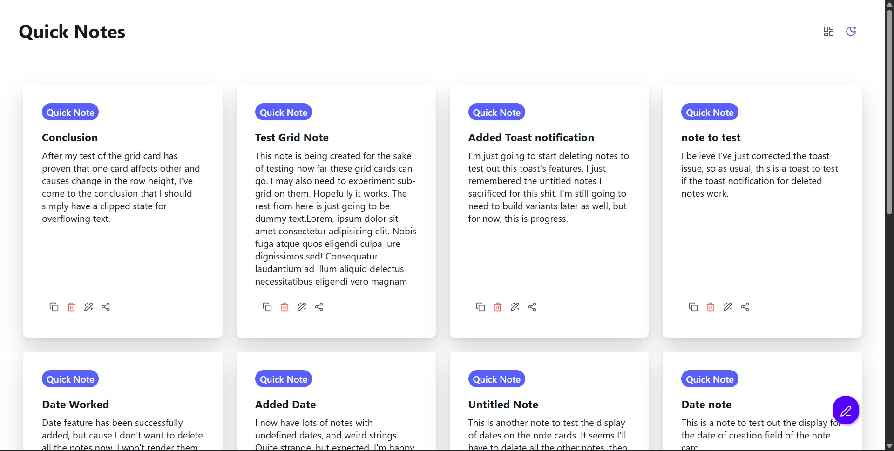

# Intentus Notes Section
The notes section of the Intentus productivity app.



# Features:
1. Dialog to create note
2. Grid-style note previews
3. Deletion of notes
4. Note editing
5. Theme Switching
6. Floating action button
7. Layout Changes
8. Animated Deletion state
9. Theme change transitions
10. Date of creation
11. Use Illustration for empty state
12. Add deleted item toast

# Upcoming:
1. [] Extract Dialog Component
2. [✔️] Add tooltip component
3. [✔️] Add Relative date of creation
4. [✔️] Add checkbox to delete
5. [✔️] Add date sorting
6. [✔️] Add delete all
7. [] undo delete toast
8. [] Save layout changes
9. [✔️] Add filters
10. [] Add note pinning capabilities

# Roadmap

**V1.1.0**:
1. [✔️] Editing & Deleting: Click on edit button to make title and content editable:
    ```html
    <h1 contenteditable="true">Note Title</h1>
    <p contenteditable="true">Note Content...</p>
    ``` 
2. ~~Edited tag (possibly)~~. (scrapped)
3. [✔️] Use `localstorage` to save settings.
4. [✔️] Relative Date of Creation.
5. [✔️] Modal to create note
6. [✔️] Shareable notes.

**V1.2.0**:
1. [✔️] Date Sorting.
2. [✔️] Checkbox to delete.
3. [✔️] Delete all feature.
4. [✔️] Layout Changes: Allow users to decide to use grid or list view for their notes

**V1.3.0**:
1. [] Sidebar.
2. [✔️] Filters.
3. [✔️] Searchable content.
4. [] Full page editing: Contains amount of characters.
5. [] Pinned Notes

**V2.0.0**:
1. Migrate to indexedDB
2. Firebase Server and Database Integration.
3. Account Creation and syncing.
4. Folder Creation.
5. Remote configurations.

**V2.1.0**:
1. Rich text editing
2. Special commands: Allow commands using "/" e.g. "/link" to create a link. Inspo from Notion.
3. Attachments: Allow attachment of files, excel tables, word documents, images and even powerpoint slides.
4. Auto1.complete and auto1.correct in full page editing with AI(if possible)